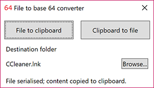

# FileToBase64
A simple project that allows a user to serialise a file in base 64 to the clipboard, and vice-versa.

## Getting started
These instructions will guide you in the usage of the program.

### Prerequisites
The only prerequisite is to have .NET 4.6.1.

### Installing
The usage is pretty simple: compile the project (if necessary) and simply execute the *FileToBase64.exe*.  
If the program came on a stand alone version (in a zip file for example), the package must contains the following files:
* *FileToBase64.exe*: application;
* *FileToBase64.exe.config*: configuration file for the application;
* *FileToBase64.pdb*: debugging information file;
* *log4net.config*: configuration for the logger;
* *log4net.dll*: logger library;
* *log4net.xml*: examples for logging configuration.

## Using the application


### Principle
The application serialises a file that the user provides; the results is copied to the clipboard with the filename and its MD5 checksum.  
The user can then use the application on another computer (via remote desktop for instance) to deserialise the clipboard content to a file.  
This way, one can "override" a blocked network or a firewall too restrictive (for instance, for *exe* files).  
A log file named *FileToBase64.log* is available (except when it's the first use) at the root folder.

### Serialising a file
There are 2 ways to serialise a file to the clipboard: drag and drop a file onto the *File to clipboard* button or select a file with this button.  
When the button is clicked, a file dialog pops-up to select a file to serialise:  


Once a file has been selected (or drag and dropped onto the *File to clipboard* button), the file is serialised and the path is updated with the file name.  
An information text is displayed whether the serialisation has been successful or not:  


The log file is also written to.  
At this point, the file is serialised to base 64 into the clipboard. The clipboard content has this format:

```xml
<?xml version="1.0" encoding="utf-8"?>
<FileToBase64>
  <Base64File>[file serialised to base 64]</Base64File>
  <filename>CCleaner.lnk</filename>
  <MD5>[MD5 checksum of the file]</MD5>
</FileToBase64>
```

### Deserialising a file
The first step to deserialise the clipboard content to a file is to choose the destination.  
By default, the target folder is set to the desktop of the current user. One can change the destination by selecting a target folder by clicking the *Browse..."* and selecting a new folder:  


When selected, the path of the target folder is updated.  
One simply has to click on the *Clipboard to file* button to deserialise the file to this folder.  
If the file already exists, an error occurs and the file is not deserialised to prevent overwriting.  
If a file has just been serialised and the user clicks on the *Clipboard to file* button without choosing a target folder, the desktop is automatically set as the target folder.  
Once again, everything is logged into the log file.

### Customised login
Logging is made with the help of [log4net](https://logging.apache.org/log4net/).  
By default, all is logged to the *FileToBase64.log*.  
Customised logging is possible, using the *log4net.config* file.

